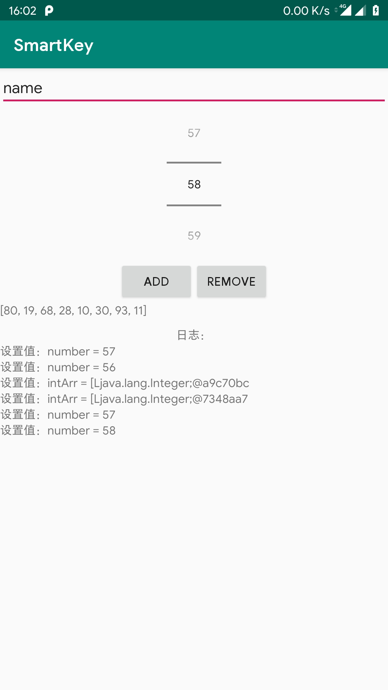

[](https://jitpack.io/#Vove7/SmartKey)

# SmartKey

> 利用Kotlin委托实现优雅地持久化存储应用配置。

1. 支持纯Kotlin项目
2. 支持Android项目
3. 支持自定义持久化实现


- [基本使用](#基本使用)
- [更多操作](#更多操作)
- [基本存储实现](#基本存储实现)
- [自定义持久化实现](#自定义持久化实现)
- [引入SmartKey](#引入SmartKey)

### 基本使用

#### 初始化

1. 定义配置类
```kotlin
//这里可以使用注解配置存储文件名，多个配置类可分文件存储
@Config("app_config", implCls = JsonSettings::class)
object AppConfig {

    //基本类型存储
    var text: String by smartKey("a")

    //可空基础类型
    var nullableInt: Int? by smartKey(null)
    var number: Int  by smartKey(50)

    //数组
    var intArr: Array<Int> by smartKey(emptyArray())

    //实体类
    var userInfo: UserInfo? by smartKey(null, encrypt = true)
}

//实体类
data class UserInfo(
        var name: String,
        var email: String,
        var age: Int
)

```


2. 此时你可以像这样使用

```kotlin
//获取存储值
val value = AppConfig.text
val n = AppConfig.number 

//实时存储
AppConfig.text = "setValue"
AppConfig.number = 0

//存储登录用户数据
val user = UserInfo("new_user", "xx@xx.xx", 0)
AppConfig.userInfo = user

//注意修改实体中的属性无法触发持久化操作
user.name = "hello"
//需要赋值操作触发
AppConfig.userInfo = user

```

3. 配置类附加功能

继承`AConfig`拥有配置类基础操作
```kotlin
object AppConfig : AConfig() {
    //...
}
```
```kotlin

//清空此配置所有key
AppConfig.clear()

//直接存储key
AppConfig["key"] = 1 //key, value
AppConfig["text"] = "abc" //key, value

val s = AppConfig["text", "default"]//key, default

//普通存储
AppConfig["key"] = 1
//加密储存
AppConfig["key", true] = 1  


//获取可空数据
val user = AppConfig.get<UserInfo?>("userInfo", null)

val user = AppConfig["userInfo", null as UserInfo?]

//获取加密内容
val user: UserInfo? = AppConfig["userInfo", null as UserInfo?, true] // ?

```

### demo

见app目录



### 更多操作

- 你可以指定变量对应存储的key：
```kotlin
    //指定key 
    //import cn.vove7.smartkey.smartKey
    var text: String by smartKey("defaultValue", key = "your_key")
    
    //安卓项目可通过resId指定keyId
    //import cn.vove7.smartkey.android.smartKey
    var textAndroid: String by smartKey("defaultValue", keyId = R.string.key)
```

- 选择是否加密数据：

```kotlin
    //使用encrypt来声明加密存储数据
    var userInfo: UserInfo? by smartKey(null, encrypt = true)

```

- 为每个配置类设置存储实现

> 不指定`implCls`时, 默认实现为`JsonSettings`

```kotlin
@Config(implCls = FileSettings::class)
class AppConfig1 {

}

@Config(implCls = PropertiesSettings::class)
class AppConfig2 {

}
```


- 无缓存的NoCacheKey

由于`SmartKey`会对value进行缓存，在多进程会存在问题。因此而生的`NoCacheKey`，保证读取的数据是实时的。
使用和SmartKey基本一致。

另外，在使用基于文件存储的Settings时，修改文件配置`NoCacheKey`可以监听文件变化，来载入最新配置。

```kotlin
    var text: String by noCacheKey("defaultValue", key = "your_key")
```


### 基本存储实现

- JsonSettings

使用json格式存储配置。
 
- PropertiesSettings

基于java `PropertiesSettings`持久化  
可设置`baseDir` `PropertiesSettings.baseDir = "..."`

- FileSettings

使用文件存储。  
可设置`baseDir` `FileSettings.baseDir = "..."`


### 自定义持久化实现

1. 实现`com.russhwolf.settings.Settings`接口

```kotlin
//必须存在构造函数(val configName:String)

class MySettingsImpl(val configName:String) : Settings
```

2. 使用自定义实现类

在配置类设置注解参数`implCls`：

```kotlin
@Config(implCls = MySettingsImpl::class)
class AppConfig {

}
```

### 引入SmartKey

###### Step 1. Add it in your root build.gradle at the end of repositories:
```groovy
allprojects {
    repositories {
        //...
        maven { url 'https://jitpack.io' }
        maven { url = 'https://dl.bintray.com/russhwolf/multiplatform-settings' }
    }
}
```
###### Step 2. Add the dependency

- Kotlin

```groovy
dependencies {
    implementation "com.github.Vove7.SmartKey:smartkey:$lastest_version"
}
```

- Android
 
```groovy
dependencies {
    implementation "com.github.Vove7.SmartKey:smartkey-android:$lastest_version"
}
```
> lastest_version : [](https://jitpack.io/#Vove7/SmartKey)

### TODO

- ExpirableKey


### Thanks

- [Kotlin](https://kotlinlang.org/)
- 底层存储使用[multiplatform-settings](https://github.com/russhwolf/multiplatform-settings)
- [FastJson](https://github.com/alibaba/fastjson)
